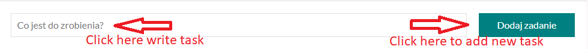
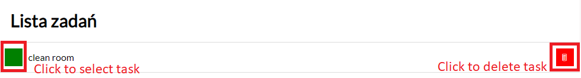

# Task List

## Table of content
- [Demo](#demo)
- [Project purpose](#project-purpose)
- [How to use](#how-to-use) 
- [Short review](#short-review)
- [Used features](#used-features)
 

 ## [DEMO](https://mardrog.github.io/Tasks_list/)

## Project purpose
This site was created to learn mainly using functions in javasrpit. I'am creating here empty table and function which render whole html which is shown as a tasks list. Other functions are here to for example delete task or check which one is done. 

## How to use
 1. Step one:  
 Write a sample to do task and click button "Dodaj zadanie" to add new task
 
 2. Step two:  
 When task is added, you can mark it as done or delete it. To do this just click on green button to check it or red button to delete task
 

## Short review

## Used features:
- FLEX
- BEM
- ES6

