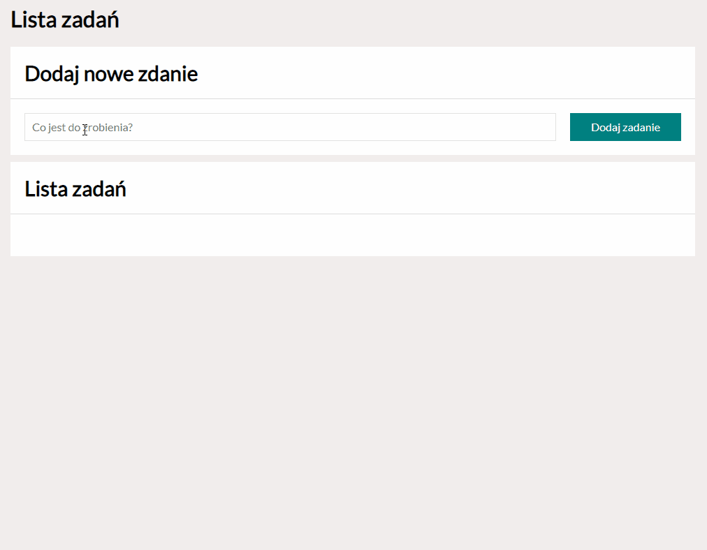

# Task List

## Table of content
- [Demo](#demo)
- [Project purpose](#project-purpose)
- [Short review](#short-review)
- [Used features](#used-features)
 
 ## [DEMO](https://mardrog.github.io/Tasks_list/)

## Project purpose
This site was created to learn mainly using functions in javasrpit. I'am creating here empty table and function which render whole html which is shown as a tasks list. Other functions are used for deleting assignments and marking these which are already done. 

## Short review

## Used features:
- HTML
- CSS
- FLEX
- BEM
- ES6

